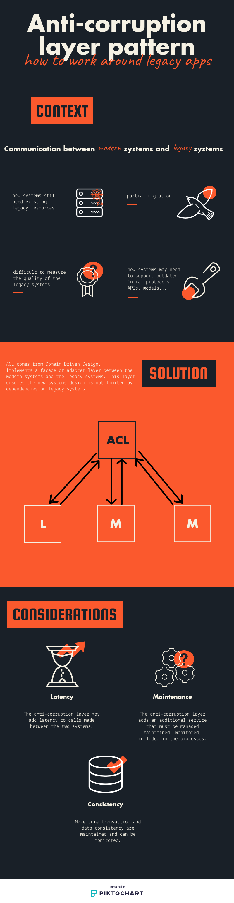

# Anti-corruption layer pattern

> How to work around legacy apps



## Example

We have the following applications:

- One legacy app made as a Kotlin application with Spring Boot
  - It is exposed at port 8080
  - It contains 1 endpoint: http://localhost:8080/cats
  - The entity `Cat` contains the following:

```json
[
  {
    "catType":"Arabian Mau",
    "name":"Tony",
    "weight":5
  },
  {
    "catType":"Grumpy cat",
    "name":"Tadar Sauce",
    "weight":6
  },
  {
    "catType":"Cat with Pop-Tart for a body, flying through space, and leaving a rainbow trail behind it",
    "name":"Nyan cat",
    "weight":10000
  }
]
```

- One modern app made with Golang
  - It is exposed at port 3001
  - It contains 1 endpoint: http://localhost:3001/cats
  - The entity `Cat` contains the following:

```json
[
  {
    "color":"Orange",
    "name":"Tony"
  },
  {
    "color":"Black & White",
    "name":"Tadar Sauce"
  },
  {
    "color":"Multi-color",
    "name":"Nyan cat"
  }
]
```

- Another modern app made with Golang
  - It is exposed at port 3002
  - It contains 1 endpoint: http://localhost:3002/cats/{catName}/bed
  - The entity `Bed` contains the following:

```json
{
  "catName":"Tony",
  "name":"Cuddle cup"
}
```

We want to get the information of the cats with their bed:

```json
[
  {
    "color": "Orange",
    "bed": {
      "name": "Cuddle cup"
    },
    "name": "Tony",
    "type": "Arabian Mau"
  },
  {
    "color": "Black & White",
    "bed": {
      "name": "Cardbox"
    },
    "name": "Tadar Sauce",
    "type": "Grumpy cat"
  },
  {
    "color": "Multi-color",
    "bed": {
      "name": "Cuddle cup"
    },
    "name": "Nyan cat",
    "type": "Cat with Pop-Tart for a body, flying through space, and leaving a rainbow trail behind it"
  }
]
```

So, our ACL will be in charged to fetch the information needed from the legacy code and clean them,
call the modern apps to complete the desired output.

## Running the example

```bash
docker-compose up
# Calling this url will target the legacy app for the entity "cat"
curl -L http://localhost:8080/cats
# Calling this url will target the modern app for the entity "cat"
curl -L http://localhost:3001/cats
# Calling this url will target the modern app for the entity "bed"
curl -L http://localhost:3002/cats/Tony/bed
# Calling this url will target the ACL
curl -L http://localhost/cats
# Notice the final representation of the entity of the cat does not have the undesired
# field "weight", the field "catType" has been changed to "type" and we linked the
# entity "bed" to each cat.
```

## Sources

- [Microsoft Azure](https://docs.microsoft.com/en-us/azure/architecture/patterns/anti-corruption-layer)
- [Stackoverflow](https://softwareengineering.stackexchange.com/questions/184464/what-is-an-anti-corruption-layer-and-how-is-it-used)
- [Mark Needham](http://www.markhneedham.com/blog/2009/07/07/domain-driven-design-anti-corruption-layer/)
