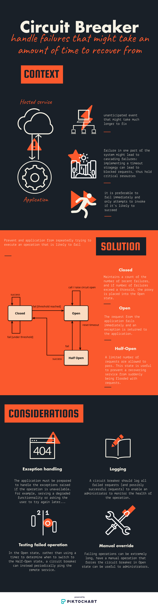

# Circuit breaker patterns

> Handle transient failures to improve application stability



## Examples

We have the following applications:

- One app exposing a REST endpoint to fetch `cats`:
  - It is exposed at port 3000
  - It contains 1 endpoint: http://localhost:3000/cats
- One gateway that transmits the requests to the cat service

### Running the example

```bash
docker-compose up
# Call the url with the query parameter 'SUCCESS' to simulate a success query
curl -i -X POST http://localhost/cats?status=SUCCESS -d '{"name": "foo", "type": "bar"}'
# Call the url with the query parameter 'FAILURE' to simulate a failure query
curl -i -X POST http://localhost/cats?status=FAILURE -d '{"name": "foo", "type": "bar"}'
# Play with those queries and check the logs to check the application state on the circuit breaker
```

## Sources

- [Microsoft azure](https://docs.microsoft.com/en-us/azure/architecture/patterns/circuit-breaker)
- [Rahul Rajat Singh's blog](http://rahulrajatsingh.com/2016/10/understanding-retry-pattern-with-exponential-back-off-and-circuit-breaker-pattern/)
- [Martin Fowler](https://www.martinfowler.com/bliki/CircuitBreaker.html)
