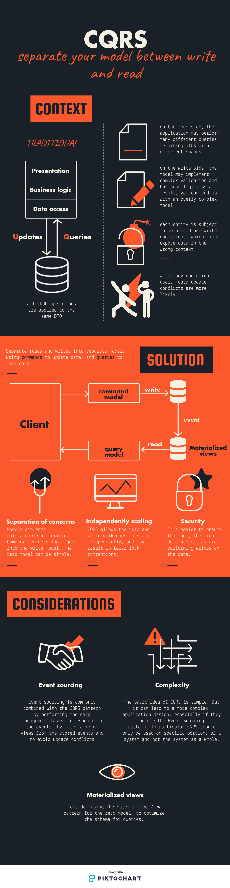

# Command Query Responsability Segregation

> Separate your model between write and read

## Examples

### Simple example

WIP

#### Running the example

WIP

### Coupling with "Event sourcing"

WIP

#### Running the example

WIP

## Sources

- [Microsoft Azure](https://docs.microsoft.com/en-us/azure/architecture/patterns/cqrs)
- [Piotr Korlaga](https://medium.com/applantic/applantic-what-is-cqrs-f32039d746bc)
- [Stackoverflow](https://stackoverflow.com/questions/47048839/cqrs-and-event-sourcing-difference)
