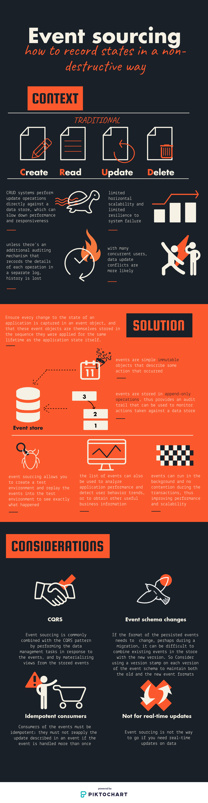

# Event sourcing

> Record states in a non-destructive way



## Example

We have the following applications:

- One app exposing REST endpoints:
  - It is exposed at port 3001
  - It contains 2 endpoints:
    - http://localhost:3000/cats
    - http://localhost:3000/cats/{id}/events
- A Zookeeper
- Kafka to register the events

## Running the example

```bash
docker-compose up
# Calling this command will consume the message
docker exec -it eventsourcing_kafka_1 /opt/kafka/bin/kafka-console-consumer.sh --bootstrap-server localhost:9092 --topic events --from-beginning

# Open another terminal session
# Notice in the kafka consumer, the events are appended
curl -i -X POST http://localhost:3000/cats/1/events -d '{"message": "eat"}'
curl -i -X POST http://localhost:3000/cats/1/events -d '{"message": "poop"}'
curl -i -X POST http://localhost:3000/cats/1/events -d '{"message": "annoy owner"}'
```

## Sources

- [Microsoft Azure](https://docs.microsoft.com/en-us/azure/architecture/patterns/event-sourcing)
- [Stackoverflow](https://stackoverflow.com/questions/47048839/cqrs-and-event-sourcing-difference)
- [Martin Fowler](https://martinfowler.com/eaaDev/EventSourcing.html)