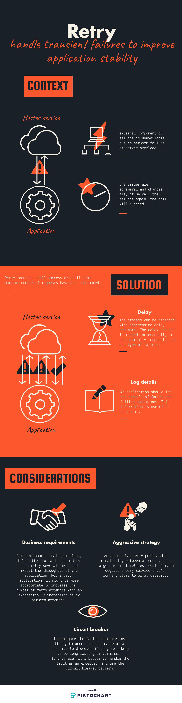

# Retry patterns

> Handle transient failures to improve application stability



## Examples

We have the following applications:

- One app exposing a REST endpoint to fetch `cats`:
  - It is exposed at port 3000
  - It contains 1 endpoint: http://localhost:3000/cats
- One gateway that transmits the requests to the cat service

### Running the example

```bash
docker-compose up
# Call the url and check the logs
curl -i http://localhost/cats?maxRetry=10
# Change the query parameter to see the response when the max retry count is reached
curl -i http://localhost/cats?maxRetry=2
```

## Sources

- [Microsoft azure](https://docs.microsoft.com/en-us/azure/architecture/patterns/retry)
- [Rahul Rajat Singh's blog](http://rahulrajatsingh.com/2016/10/understanding-retry-pattern-with-exponential-back-off-and-circuit-breaker-pattern/)
- [Service design pattern](http://www.servicedesignpatterns.com/WebServiceInfrastructures/IdempotentRetry)
