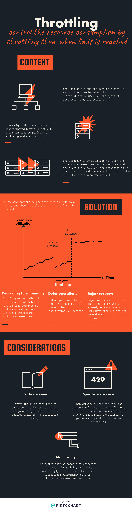

# Throttling pattern

> Control the resource consumption by throttling them when limit is reached



## Example

We have the following application:

- One app exposing a REST endpoint to fetch `cats`:
  - It is exposed at port 3000
  - It contains 1 endpoint: http://localhost:3000

## Running the example

```bash
docker-compose up
while true;do curl -i http://localhost:3000; sleep 1; done
```

## Sources

- [Microsoft Azure](https://docs.microsoft.com/en-us/azure/architecture/patterns/throttling)
- [Java design patterns](https://github.com/iluwatar/java-design-patterns/tree/master/throttling)